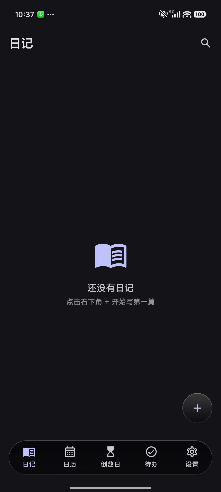
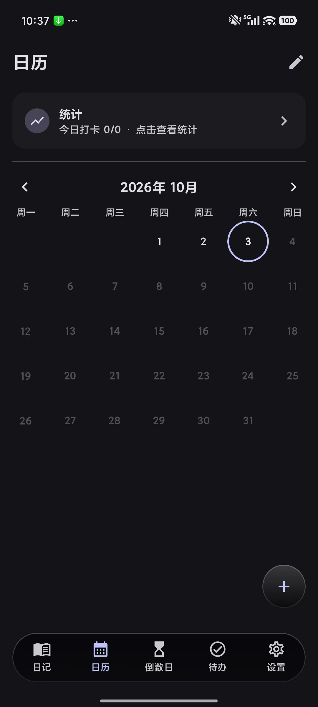
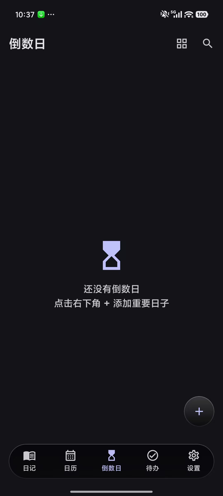
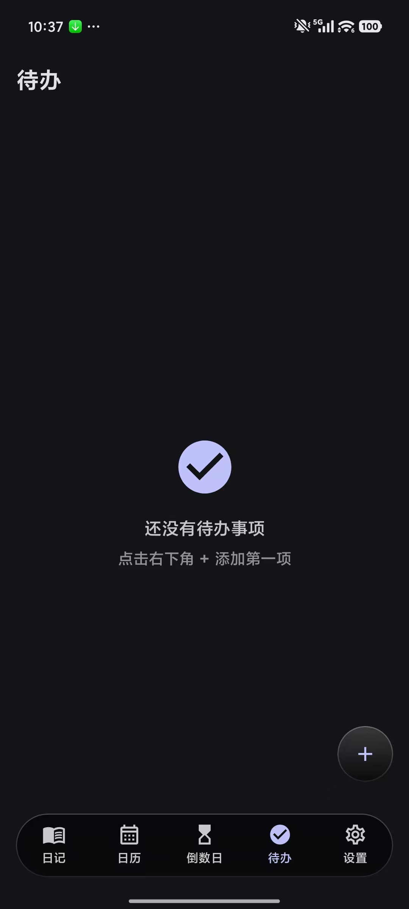
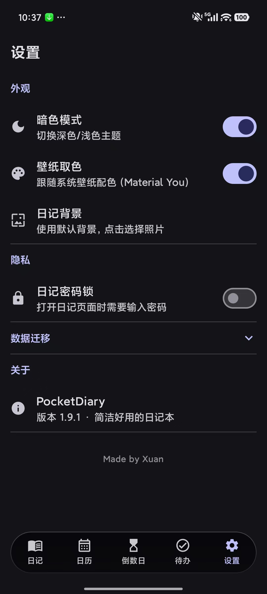
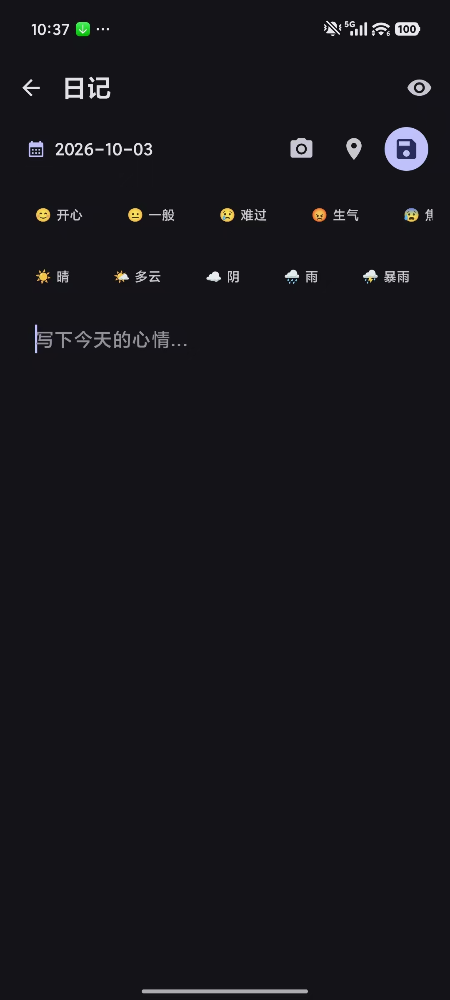
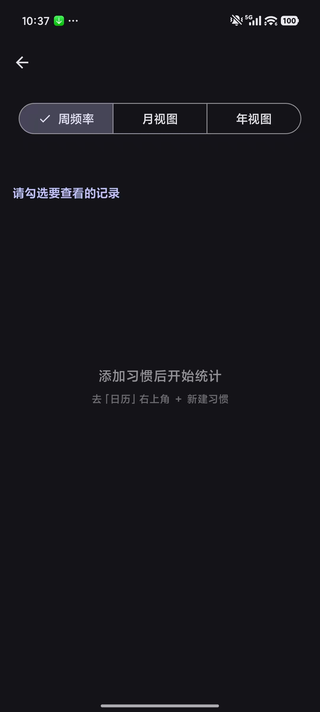
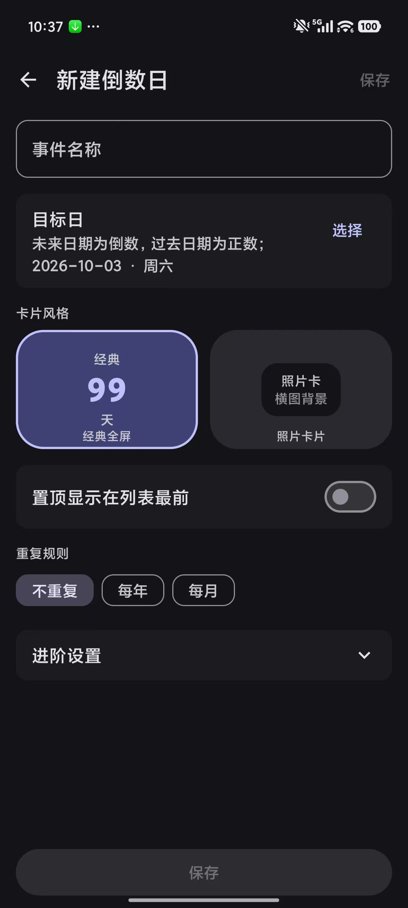
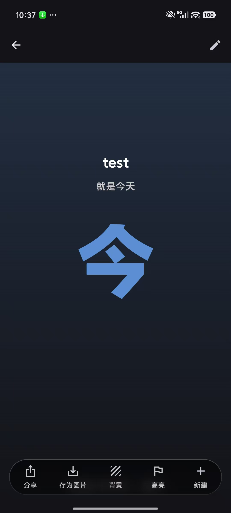

<div align="center">

# 📖 PocketDiary

**A minimal, delightful Android diary app · Liquid-glass UI · 100% offline, data stays on your device**


**English** | [简体中文](README.zh-CN.md)

**[⬇️ Download](#-download)** · **[✨ Features](#-features)** · **[🛠️ Tech Stack](#-tech-stack)**

</div>

---

## 📸 Screenshots

<table>
  <tr>
    <td align="center" width="33%">
      
      <br><sub><b>Diary</b> · empty state + glass bottom bar / FAB</sub>
    </td>
    <td align="center" width="33%">
      
      <br><sub><b>Habit calendar</b> · stats entry + month view</sub>
    </td>
    <td align="center" width="33%">
      
      <br><sub><b>Countdown</b> · list / grid views</sub>
    </td>
  </tr>
  <tr>
    <td align="center">
      
      <br><sub><b>Todos</b> · dark list + completed fold-away</sub>
    </td>
    <td align="center">
      
      <br><sub><b>Settings</b> · appearance / privacy / migration</sub>
    </td>
    <td align="center">
      
      <br><sub><b>Editor</b> · mood / weather / location / photos</sub>
    </td>
  </tr>
  <tr>
    <td align="center">
      
      <br><sub><b>Statistics</b> · weekly / monthly / yearly</sub>
    </td>
    <td align="center">
      
      <br><sub><b>New countdown</b> · classic / photo card styles</sub>
    </td>
    <td align="center">
      
      <br><sub><b>Countdown detail</b> · fullscreen number + share card</sub>
    </td>
  </tr>
</table>

---

## ✨ Features

### 📖 Diary
- **One entry per day**, auto-archived by date (`date` unique index; changing the date moves the entry), split by month with big day numbers
- Record **mood, weather, and location** — one-tap geocoding to a readable address; weather picked manually
- **Markdown writing & preview** (commonmark parser + custom subset renderer), **rich posts** with up to 7 inline photos
- **Full-text search** (250 ms debounce), **swipe-to-delete** with a confirmation dialog, two-line card previews
- **Custom list background**: import a photo in Settings and every card gets a real **backdrop blur** (GraphicsLayer + BlurEffect, API 31+)
- **Diary PIN lock**: 4–6 digits, three unlock modes (per session / every visit / once per day), re-auth to change the PIN, SHA-256 salted hashing, 30 s lockout after 5 failed attempts

### 📅 Habit Calendar
- Monthly calendar with a full habit check-in system; each day cell shows **colored dots** for completed habits (up to 3)
- Tap any date to tick items one by one — **past days can be back-filled**, future days are locked
- Habit names and emoji icons are fully customizable
- **Statistics screen** in three views: **weekly frequency** (rolling 10-week window) / **monthly** / **yearly**
- Every point on the line chart carries a **value label**; the current period is **highlighted**; toggle habits at the bottom to show/hide curves

### ⏳ Countdown
- **Classic fullscreen** and **photo card** styles; blue/orange badges, pin-to-top, yearly/monthly repeat
- Correct three-state date math (Today / Countdown / Countup — month- and leap-year-safe, +1 day semantics)
- **Off-screen rendered share cards** (1080×1440), per-event background photos; photo cards support vertical reframing by drag
- List / grid views, procedural texture backdrops

### ✅ Todos
- Dark list with **completed items folded away**; checking an item sinks/rises it; edit directly in a sheet (no separate page)
- **Exact-alarm reminders**: notification mode or **full-screen alarm-ringer mode** (`setAlarmClock`, rings on the lock screen), daily repeat, 5-minute snooze
- **Automatic rescheduling** after reboot / timezone or clock change, with missed plain notifications re-posted; MIUI auto-start detection with a deep link to the permission page
- Notifications and ringer deep-link straight to the todo (`open_todo_id`)

### ⚙️ Settings
- Dark / light mode **independent of the system**, splash color follows the in-app theme; **Material You wallpaper colors**
- Privacy section (PIN lock), collapsed data-migration panel, custom diary background with restore-to-default
- **Data migration**: export / import ZIP (full overwrite + transaction rollback + version gate + zip-slip/CRC checks)
- About page version reads `BuildConfig.VERSION_NAME` automatically

### 🎨 Design Language
- **True liquid glass**: floating capsule bottom bar and FAB sample the content behind them for a live backdrop blur
- Card hierarchy uses `surfaceContainerLow/High` tones; all radii and spacing come from design tokens (no magic numbers)

## 📥 Download

Grab the latest `app-release.apk` from the [**Releases page**](https://github.com/Micheal-Reber/PocketDiary/releases) and install it on your phone (allow installation from unknown sources).

> Requires **Android 8.0 (API 26)+**; the full glass/backdrop-blur effects render on **Android 12 (API 31)+**.

## 🛠️ Tech Stack

| Area | Choice |
|------|--------|
| Language | Kotlin 1.9.24 (**no Kotlin 2.x / Compose 1.8+ / M3 1.4** dependencies) |
| UI | Jetpack Compose + Material 3; glass effects via `GraphicsLayer` + `BlurEffect` |
| Database | Room **v14** (5 tables: DiaryEntry / Habit / HabitRecord / CountdownEvent / TodoItem; handwritten migration chain v9→14) |
| Preferences | DataStore Preferences |
| Navigation | Navigation Compose (5 bottom tabs + editor + statistics + countdown sub-routes) |
| Architecture | ViewModel + Repository + Flow unidirectional data flow |
| Location | Stock LocationManager (no Play Services dependency) |
| Backup | kotlinx-serialization JSON + streaming ZIP (STORED CRC + version gate) |
| Reminders | AlarmManager (`setExactAndAllowWhileIdle` / `setAlarmClock`) + reboot/timezone rescheduling |
| Markdown | org.commonmark parser + custom subset renderer |
| Build | **KSP** for Room (not kapt) |
| Splash | Plain-color system splash (no logo, follows the in-app theme) |

## 🚀 Build

1. Install **JDK 17** and the Android SDK (platform 35)
2. Set `JAVA_HOME` and `ANDROID_HOME`
3. Signing (optional): put `pocketdiary.jks` in the repo root plus a gitignored `keystore.properties` (`storePassword`/`keyAlias`/`keyPassword`)
4. Run:

```bash
./gradlew test               # JVM unit tests (run before every release)
./gradlew assembleDebug      # debug build
./gradlew assembleRelease    # signed release build (when keystore.properties exists)
```

> **Debug and release use different signatures** — overwriting an install requires uninstalling the old build first (data will be wiped).

## 📂 Project Structure

```
app/src/main/java/com/example/diary/
├── MainActivity.kt            # entry: in-app theme override (independent of system) + open_todo_id deep link
├── DiaryApplication.kt
├── receiver/                  # TodoAlarmReceiver / BootCompletedReceiver (alarms + reboot/timezone rescheduling)
├── util/                      # DateUtils shared date/reminder formatting
├── data/
│   ├── backup/                # BackupData / ExportService / ImportService / BackupRepository
│   ├── countdown/             # DateMath + ShareCardRenderer (share images) + TextureLibrary (textures)
│   ├── image/                 # BackgroundImageStore (relative paths) / EventImageStore
│   ├── local/                 # Room v14: entities + DAOs + MIGRATION_* chain
│   ├── location/              # LocationManager wrapper (no GMS)
│   ├── photo/                 # DiaryPhotoStore two-phase lifecycle for photo posts
│   ├── preferences/           # DataStore: theme / background / wallpaper colors / PIN lock
│   ├── repository/            # repository layer (SaveResult for date conflicts)
│   └── todo/                  # TodoReminderScheduler + TodoNotificationHelper + TodoAlarmNotifier (full-screen ringer)
└── ui/
    ├── components/            # SharedUi: swipe-delete / confirm / search / date picker / preset chips
    ├── countdown/             # Countdown: list / edit / detail + dual card styles
    ├── diary/                 # Diary list: month split, swipe delete, blurred background, search
    ├── editor/                # Editor: borderless writing, Markdown preview, photo posts
    ├── habits/                # Habit calendar + statistics charts (self-built LineChart) + ViewModel
    ├── lock/                  # PIN lock keypad screen
    ├── navigation/            # Bottom tabs + routes + glass bottom bar / FAB (GlassBottomBar)
    ├── settings/              # Settings (data migration + About reading BuildConfig)
    ├── theme/                 # Material 3 theme + radius/spacing tokens
    └── todo/                  # Todos list + edit/reminder sheets + ring activity
```

## 🧪 Tests

JVM unit tests cover `DateMathTest` (countdown date math) / `TodoReminderSchedulerTest` (reminder scheduling) / `BackupSerializationTest` + `BackupVersionGateTest` (backup serialization & version gate) / `TodoRepositoryTest` (Robolectric) / `BlurCacheTest` (blur cache tiers):

```bash
./gradlew test
```

## 📄 License

[MIT](LICENSE) © Micheal-Reber
